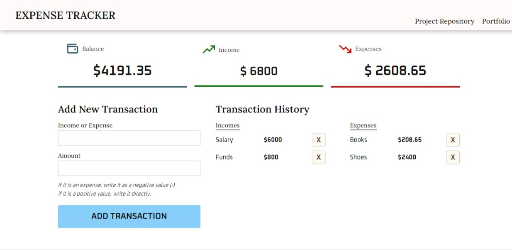

# <a href="https://expense-tracker-banuaggun.vercel.app/" target="_blank">Expense Tracker</a>

This project is a web application that allows users to easily track their income and expenses. The features of the project are as follows:

**Balance**: Shows users their current balance. Income and expenses affect the balance.

**Income**: Shows users their total earnings. Users can add new transactions to add income.

**Expense**: Shows users their total expenses. Users can add new transactions to add expenses.

**Add New Transaction**: Allows users to add income or expenses. The transaction type, amount, and description are entered. If it is an expense, the amount is written as negative (-). If it is income, the amount is written directly.

**Transaction History**: Shows users all the transactions they have added. Transactions are colored as income or expense. Users can click on the trash can icon to delete transactions.

**Local Storage**: The project uses the local storage feature to store user transactions in the browser. This way, users do not lose their data when they refresh or close the page.

## Technologies & Libraries

> Vue 3

> Vite

> Vue Toastification

> Phosphor Icons

